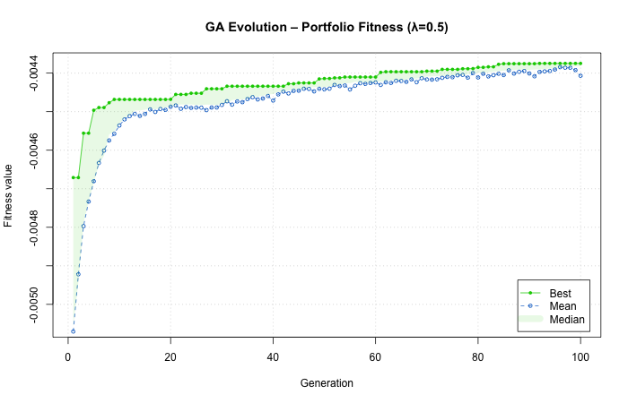

---

# 📈 Portfolio Optimization & Asset Selection using Genetic Algorithms (R)

A complete, reproducible demonstration of **evolutionary optimization in finance**, built as part of an MSc Data Science project.
This project applies **Genetic Algorithms (GA)** to optimize portfolio weights and perform **asset selection** with real market data.
All analysis is performed in **R**, leveraging `GA`, `tidyquant`, and `PerformanceAnalytics`.

---

## 🎯 Objectives

* Optimize stock portfolio weights for **maximum risk-adjusted return (Sharpe Ratio)**.
* Perform **asset selection** from a multi-sector universe using a **binary GA**.
* Compare against **equal-weight** and **random portfolios**.
* Evaluate generalization through **out-of-sample (OOS)** testing and a **lambda-sweep** sensitivity study.

---

## 🧠 Methodology

1. **Data Collection:** Stock price data pulled automatically from *Yahoo Finance* using `tidyquant`.
2. **Return Computation:** Daily log-returns calculated and split into train (2021-2023) and test (2023-2024).
3. **GA Optimization:**

   * Fitness = ( (1 - \lambda),R - \lambda,\sigma ), balancing return and risk.
   * Parameters: population = 50, generations = 100, mutation = 0.2.
4. **Baselines:** Equal-weight and 100 random portfolios.
5. **Lambda Sweep:** λ ∈ {0.2 – 1.0} to observe return–risk trade-offs.
6. **Binary GA Asset Selection:** Evolves a subset of ~40 assets to maximize mean Sharpe ratio.

---

## 📊 Data

All price data are fetched dynamically from **Yahoo Finance** through the `tidyquant` API.
The `/data` folder is provided for reproducibility but remains empty in the repository.
To save the processed data locally, uncomment the following lines in the scripts:

```r
write.csv(train_mat, "data/train_returns.csv", row.names = FALSE)
write.csv(test_mat,  "data/test_returns.csv",  row.names = FALSE)
```

---

## 🧰 Tech Stack

`R` · `GA` · `tidyquant` · `dplyr` · `PerformanceAnalytics` · `ggplot2` · `tidyr`

---

## ▶️ How to Run

```bash
# 1. Install dependencies
Rscript -e "install.packages(c('GA','tidyquant','dplyr','PerformanceAnalytics','ggplot2','tidyr'))"

# 2. Run optimization and asset selection
Rscript R/01_portfolio_optimization.R
Rscript R/02_asset_selection_ga.R
```

Results will be written automatically to the `/results` folder.

---

## 📈 Results

| Dataset   | Annual Return | Annual Risk | Sharpe Ratio |
| --------- | ------------- | ----------- | ------------ |
| **Train** | 0.218         | 0.154       | 1.42         |
| **Test**  | 0.178         | 0.116       | 1.53         |

> ⚖️ The GA achieved high in-sample Sharpe ratios and maintained positive out-of-sample performance, demonstrating good generalization.

---

### GA Evolution



### Optimized Portfolio Weights

```r
weights <- read.csv("results/optimized_weights.csv")
barplot(weights$Weight, names.arg = weights$Stock,
        las = 2, col = "steelblue",
        main = "Optimized Portfolio Weights (λ = 0.5)",
        ylab = "Weight")
```

### Lambda Sweep

The λ-sweep experiment confirmed that **λ ≈ 0.4–0.6** offered the best trade-off between return and stability.

---

## 🧩 Key Insights

* **Evolutionary algorithms** can uncover non-trivial weight allocations outperforming naive baselines.
* Performance drops slightly out-of-sample, illustrating realistic regime shifts.
* **Diversification** remains critical—binary GA selection tends to over-focus on high-volatility sectors.
* A fully automated pipeline (data → optimization → evaluation) makes results reproducible.

---

## 📁 Repository Structure

```
portfolio-optimization-ga/
│
├── R/                       
│   ├── 01_portfolio_optimization.R
│   └── 02_asset_selection_ga.R
├── results/                  
└── README.md
```

---

## 📄 License

MIT License © 2025 Ankit Kothawade

---

## 👨‍💻 Author

**Ankit Kothawade**
MSc Data Science | University of Strathclyde
📍 Glasgow, United Kingdom
📫 [ankitkkothawade@gmail.com](mailto:ankitkkothawade@gmail.com) | [LinkedIn](https://linkedin.com/in/ankit-kothawade)

---

### 🏷️ Tags

`#DataScience` · `#FinanceAI` · `#GeneticAlgorithms` · `#RStats` · `#PortfolioOptimization` · `#MachineLearning`

